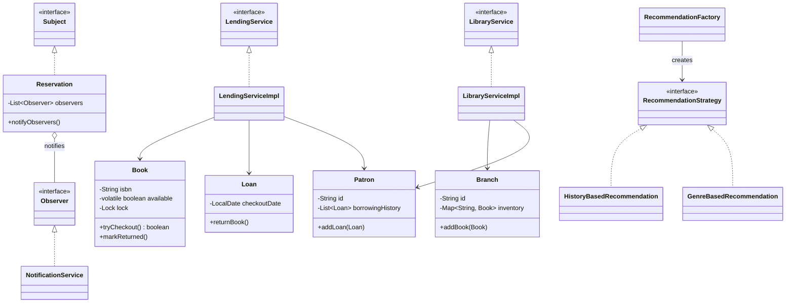

# 📚 Enterprise Library Management System (LLD)


A robust, production-ready Library Management System designed in Java. This project demonstrates advanced Object-Oriented Programming (OOP) concepts, SOLID principles, concurrent programming practices, and classic GoF Design Patterns.

## 📖 Overview

This repository contains a Low-Level Design (LLD) implementation for a multi-branch library system. It is specifically architected to handle high-concurrency environments typical of enterprise backend systems, ensuring thread safety during book checkouts, inventory management, and event notifications.

## 📂 Project Structure

```text
library-management-system/
├── src/main/java/com/library
│   ├── model/        # Domain entities (Book, Patron, Branch, Loan, Reservation)
│   ├── service/      # Business logic and interfaces (LibraryService, LendingService)
│   ├── strategy/     # Interchangeable recommendation algorithms
│   ├── observer/     # Event-driven notification system interfaces
│   ├── factory/      # Centralized object creation logic
│   ├── util/         # Shared utilities (IdGenerator)
│   └── Main.java     # Application entry point
└── README.md

```


## 🚀 Architectural Design Decisions
Thread-Safety & Concurrency: * Implemented ConcurrentHashMap for branch and patron storage to prevent structural modification issues across threads.

Utilized CopyOnWriteArrayList to prevent ConcurrentModificationException in borrowing histories and observer lists.

Applied volatile boolean flags with ReentrantLock (tryLock()) on the Book entity to guarantee atomic checkouts and prevent double-booking race conditions.

SOLID Principles: Strictly adheres to Single Responsibility, Open/Closed, and Dependency Inversion. High-level services depend exclusively on interfaces (e.g., LibraryService, LendingService).

Immutability: Encapsulated collections return List.copyOf() to prevent external actors from mutating internal domain state.

🧩 Design Patterns Implemented
Observer Pattern: The Reservation model acts as the Subject, pushing real-time domain context updates to the NotificationService whenever a reserved book becomes available.

Strategy Pattern: Decouples the recommendation logic (HistoryBasedRecommendation, GenreBasedRecommendation), allowing the system to switch recommendation engines at runtime without altering core service code.

Factory Pattern: RecommendationFactory centralizes the instantiation of the correct RecommendationStrategy.

## Why This Project?

This project demonstrates how to design a thread-safe, extensible, and production-grade system using core Java without relying on frameworks. It focuses on:

- Concurrency control
- Design pattern implementation
- Clean layered architecture
- SOLID principles

## 📊 Class Architecture



## Architecture Overview

The system follows a layered architecture:

- model → domain entities
- service → business logic
- factory → object creation
- strategy → pluggable algorithms
- observer → event-driven notifications

## Future Enhancements

- Convert to Spring Boot REST API
- Add database persistence (JPA + MySQL)
- Add unit tests (JUnit + Mockito)
- Simulate high concurrency load testing
- Implement distributed locking (Redis)